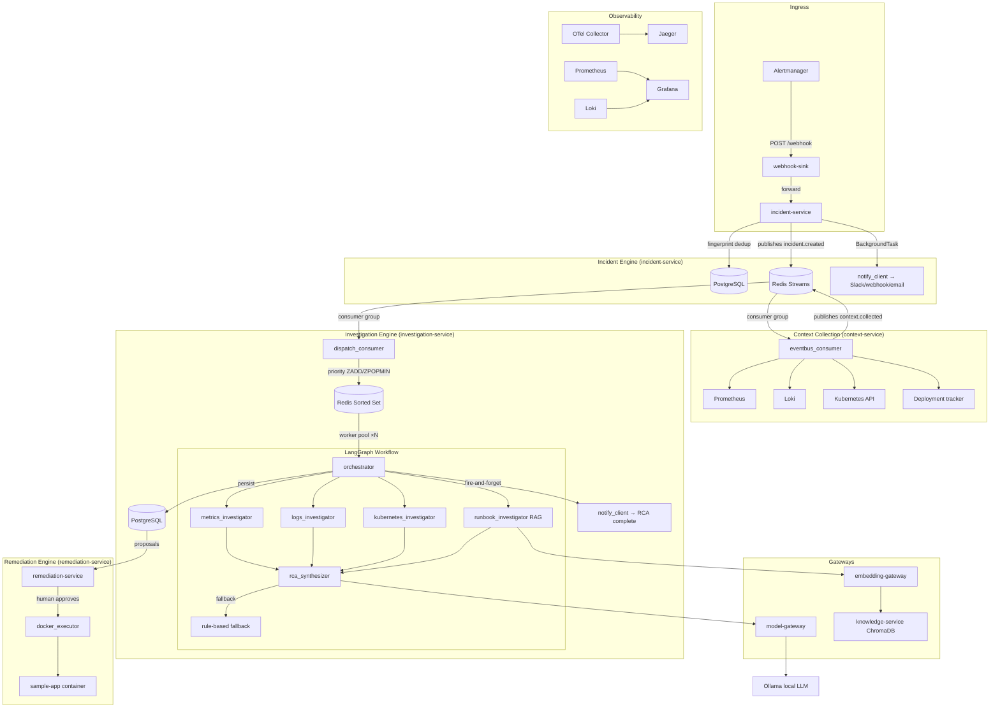

# AI-Augmented SRE Copilot

> **Enterprise-grade, locally-runnable incident investigation platform** — evidence-cited root cause analysis, human-approved remediations, and a full observability stack. No cloud account required.

[](https://github.com/rajveerkalra/ai-sre-copilot/actions/workflows/ci.yml)


---

## Table of Contents

1. [Why this project](#why-this-project)
2. [High-level architecture](#high-level-architecture)
3. [Complete data flow: alert → RCA → remediation](#complete-data-flow)
4. [Service catalogue — what each microservice does](#service-catalogue)
5. [AI & LLM design: how the investigation actually works](#ai--llm-design)
6. [Prompt engineering & measured accuracy (0% → 100%)](#prompt-engineering--measured-accuracy)
7. [Resilience patterns built into this system](#resilience-patterns)
8. [Event-driven dispatch: Redis Streams over fire-and-forget HTTP](#event-driven-dispatch)
9. [Auto-dispatch & priority-ordered worker pool](#auto-dispatch--priority-ordered-worker-pool)
10. [Outbound notifications: Slack / webhook / email](#outbound-notifications)
11. [Security: JWT, RBAC, service-mesh tokens, rate limiting](#security)
12. [Observability: OpenTelemetry, Prometheus, Grafana, Loki, Jaeger](#observability)
13. [Real bugs found and fixed (interview talking points)](#real-bugs-found-and-fixed)
14. [Kubernetes & production readiness](#kubernetes--production-readiness)
15. [Quick start](#quick-start)
16. [Repository layout](#repository-layout)
17. [Design principles & trade-off reasoning](#design-principles--trade-off-reasoning)
18. [What's next / honest limitations](#whats-next--honest-limitations)

---

## Why this project

Most "AI + SRE" projects are demos: a single LLM call that takes an alert message and returns a markdown paragraph. That's a mock, not a system.

This project is built the way an internal platform-engineering team would build it — with the full set of concerns that make AI automation safe to operate in production:

| Real problem | How this system responds |
|---|---|
| Alert fatigue from duplicate firings | Fingerprint-based deduplication — a single `Incident` row regardless of how many times Alertmanager fires the same alert |
| AI hallucinations cited as root cause | Every RCA **must** cite evidence IDs it was given; a citation-validator agent rejects or flags uncited claims |
| Risky automation | **Propose → human-approve → execute** — no remediation ever runs without an explicit `POST /remediations/{id}/approve` |
| "Demo-only" prototypes | JWT/RBAC, OTel tracing, Helm packaging, Kubernetes NetworkPolicies, audit logs — the same concerns a real team would enforce at code review |
| Slow, unordered incident processing | Redis Streams consumer groups + a priority queue (CRITICAL first, timestamp tiebreaker) + a bounded worker pool |
| AI that never learns | Operator feedback on an RCA pushes the confirmed diagnosis into RAG — the next similar incident retrieves and cites it as a runbook |

---

## High-level architecture



---

## Complete data flow

Understanding the **exact sequence** of a real incident through this system is the best demonstration of engineering depth.

### Step 1 — Alert fires

Prometheus detects `HighErrorRate` on `sample-app`. Alertmanager fires a webhook to `webhook-sink`, which forwards verbatim to `incident-service/api/webhooks`.

### Step 2 — Fingerprint deduplication (`incident-service`)

`app/services/fingerprint.py` computes a SHA-256 fingerprint from `{alertname, service, namespace, severity}`. If an open incident exists with that fingerprint, the new alert increments `occurrence_count` and escalates severity if needed (a WARNING arriving after a CRITICAL is ignored; a CRITICAL arriving against an open WARNING escalates). Only genuinely novel alerts create a new `Incident` row — one row per real incident, not one per alert firing.

### Step 3 — Durable event dispatch (Redis Streams)

Instead of a fire-and-forget `BackgroundTask` HTTP call (the original design), `incident-service` publishes an `incident.created` event to a Redis Stream (`eventbus.py`). If Redis is unreachable, `publish()` returns `None` and falls back to the direct HTTP call — a Redis outage degrades, not fails.

### Step 4 — Context collection (`context-service`)

`context-service` runs a consumer group against the stream. On receiving `incident.created` it collects:
- **Prometheus**: PromQL for error rate, latency p95, CPU/memory over the incident window
- **Loki**: structured log lines with error counts, warnings, OOM events
- **Kubernetes**: pod status, recent events, restarts
- **Deployment tracker**: recent deploy timestamps relative to incident start

All results are persisted and exposed at `GET /incidents/{id}/context`. `context-service` then publishes a `context.collected` event.

### Step 5 — Prioritized auto-investigation (`investigation-service`)

`dispatch.py` in `investigation-service` runs two background tasks:

1. **`run_dispatch_consumer`** — consumes `context.collected`, reads the incident's severity from `incident-service` (with a service-mesh `X-Service-Token`), and pushes the incident ID into a Redis sorted set scored by `{severity_rank}_{timestamp_ms}`. This is a `ZADD`/`ZPOPMIN` priority queue — CRITICAL incidents always drain before WARNING, same-severity drains oldest-first.

2. **`run_investigation_worker` × MAX_CONCURRENT_INVESTIGATIONS** — a bounded pool of workers (`asyncio.Semaphore`) pops from the queue and calls `run_investigation()`. The pool is bounded by design: LLM generation is compute-bound, so uncapped concurrency just creates a thundering-herd against Ollama.

### Step 6 — LangGraph multi-agent investigation

`orchestrator.py` calls `investigation_graph.ainvoke(initial_state)`. The graph is a LangGraph `StateGraph` with 5 parallel investigator nodes and 1 synthesis node:

- **`metrics_investigator`**: scores anomaly patterns in the Prometheus snapshot
- **`logs_investigator`**: extracts error patterns and structured log signals
- **`kubernetes_investigator`**: identifies crashloops, OOM kills, pod restarts
- **`runbook_investigator`**: vector-searches ChromaDB for similar past incidents (RAG), including any confirmed RCAs from operator feedback
- **`rca_synthesizer`**: takes all 4 agent outputs, builds a structured evidence catalog, and makes a single LLM call asking for root cause, confidence, evidence IDs, business impact, and next steps

If the LLM call fails, times out, or returns uncitable evidence IDs, `citation_validator` triggers the **deterministic rule-based fallback** (`fallback.py`) — 8 rules covering OOM, crashloop, error storm, latency, CPU, memory, dependency timeout, deployment regression.

### Step 7 — RCA persistence and notification

`RCAReport`, `Evidence`, and `AgentResult` rows are written to PostgreSQL. A fire-and-forget `asyncio.create_task` fires `notify_rca_complete` to Slack/webhook/email — never on the request path, never blocking investigation completion.

### Step 8 — Human-approved remediation

`investigation-service` proposes remediations based on the RCA. The `rca→proposal mapper` in `remediation-service` maps root causes to typed proposals (`RESTART_SERVICE`, `ROLLBACK`, `SCALE`). **Nothing executes until** `POST /remediations/{id}/approve`. On approval, `docker_executor.py` calls the Docker Engine API directly, subject to two independent code-enforced checks: `ALLOW_COMPOSE_RESTART` config flag and a hard allowlist (`RESTART_ALLOWED_SERVICES`) — verified live that a direct attempt to restart `postgres` is correctly refused.

---

## Service catalogue

| Service | Port | Role | Key tech |
|---|---|---|---|
| `incident-service` | 8000 | Alert ingestion, dedup, incident lifecycle | FastAPI, SQLAlchemy async, PostgreSQL, Redis Streams |
| `context-service` | 8020 | Evidence collection from all observability sources | FastAPI, httpx, Prometheus HTTP API, Loki, K8s client |
| `investigation-service` | 8030 | LangGraph orchestration, RCA synthesis, priority dispatch | FastAPI, LangGraph, SQLAlchemy async, Redis Sorted Set |
| `remediation-service` | 8032 | Proposal generation, human-gated execution | FastAPI, Docker Engine API |
| `knowledge-service` | 8035 | Vector store for runbooks + learned RCAs | FastAPI, ChromaDB, sentence-transformers |
| `auth-service` | 8060 | JWT issuance and validation | FastAPI, python-jose |
| `model-gateway` | 8040 | LLM routing, circuit-breaking, timeout management | FastAPI, httpx, `libs/common/resilience.py` |
| `embedding-gateway` | 8045 | Embedding routing to sentence-transformers | FastAPI |
| `executive-dashboard` | 8050 | Real-time incident KPI dashboard | Dash/Plotly, Pandas |
| `sample-app` | 8010 | Fault-injectable target app | FastAPI, Prometheus client |
| `webhook-sink` | 8080 | Alertmanager + generic notification receiver | FastAPI |

---

## AI & LLM design: how the investigation actually works

### Why LangGraph and not a single LLM call?

A single call asking "here's all the data, what's the root cause?" suffers from context-length pressure as evidence grows, and gives no visibility into which evidence source drove the conclusion. LangGraph lets each investigator node focus on one evidence type and produce a structured partial finding. The synthesizer then has clean, typed inputs from 4 specialized agents, not a blob of raw JSON.

### Evidence catalog design

Before any LLM call, `build_evidence_catalog(context)` converts raw collector output into typed `Evidence` dicts each with a stable `evidence_id` (e.g., `metrics-001`, `logs-002`). These IDs are what the RCA must cite. The citation validator checks every `evidence_id` in the RCA against this catalog — a hallucinated ID that wasn't in the catalog fails validation and triggers fallback.

### The rule-based fallback — and why it exists

A pure LLM system fails silently when the model is slow, unavailable, or uncertain. The deterministic fallback is a first-class production path, not a development crutch. 8 rules cover the most common fault patterns. The fallback runs if:
- The LLM call times out or returns an HTTP error
- The circuit breaker is open (see Resilience section)
- The citation validator rejects the LLM's evidence citations
- The model returns malformed JSON

Golden-case CI tests cover all 8 rules plus 2 adversarial off-vocabulary cases. The adversarial cases caught a real false-positive bug (see below).

### RAG-based case-based learning

`POST /investigations/{id}/feedback` accepts `{verdict: "correct" | "incorrect" | "partial", notes: "..."}`. A `correct` verdict pushes the RCA and its grounding evidence into ChromaDB via `knowledge-service`. The next similar incident's `runbook_investigator` retrieves it via semantic search. **Verified live**: a learned document ranked above seed runbooks (score 0.61 vs 0.48) for a semantically similar query. This is retrieval-based learning, not fine-tuning — appropriate for this incident volume, fully inspectable, and useful from the very first confirmed incident.

---

## Prompt engineering & measured accuracy (0% → 100%)

This is the most important technical story in the entire project. **Not asserted — measured**.

### Baseline: 0% accuracy

Running the full golden case suite against a live local `llama3.2` (3B) via Ollama with the original prompt returned `root_cause: "Insufficient evidence"` for **every single case** — including a textbook error-storm case where the evidence contained `"error_storm injected failure"` verbatim.

Two contributing causes were found:

**Bug 1 — The prompt offered "Insufficient evidence" as an explicit safe escape hatch**, and evidence was rendered as a raw Python dict repr. Small local models took the lazy answer on almost every case rather than committing to a diagnosis.

**Fix**: Render evidence as clean `- id: summary` lines. Ask a direct question ("what is the most likely root cause?"). Frame "Insufficient evidence" as a *last resort*, not a named option.

**Bug 2 — A `k8s-unavailable` evidence item** was phrased as `"Kubernetes unavailable: <reason>"` — worded like a plausible root cause. After fix 1, 4 of 8 cases converged on the model citing *this* monitoring gap as the root cause.

**Fix**: Reworded to `"Kubernetes evidence unavailable for this investigation (collector could not reach the cluster: ...). This is a monitoring gap, not a root cause — do not cite it as the cause of the incident."` (`app/services/evidence.py`).

### After both fixes: 100% accuracy (same 8 non-trivial golden cases, same model)

| | Before | After |
|---|---|---|
| Root-cause accuracy | **0%** | **100%** |
| Fallback rate | 0% | 0% |
| Per-call latency | 15-40s | 15-40s (unchanged) |

The 1B model (`llama3.2:1b`) was retested after the prompt fix — it stopped defaulting to "Insufficient evidence" but began corrupting the JSON structure (nesting `root_cause` as an object). **Use 3B (`llama3.2`) or larger.**

### Why the LLM eval is not in CI

`run_llm_eval.py` requires a real model-gateway with a live model loaded. It is slow (minutes), non-deterministic across LLM sampling runs, and depends on multi-GB infrastructure GitHub Actions runners don't have. The numbers above are reproducible with:

```bash
cd services/investigation-service
MODEL_GATEWAY_URL=http://localhost:8040 LLM_MODEL=llama3.2 LLM_TIMEOUT_SECONDS=180 \
  PYTHONPATH=../..:. .venv/bin/python -m eval.run_llm_eval --json-out eval/llm-report.json
```

---

## Resilience patterns

All external calls in this system go through `libs/common/resilience.py`:

### Circuit breaker

```
failure_threshold = 5   # trips after 5 failed calls
recovery_timeout  = 30s # half-open after 30s
```

**Bug found and fixed**: `with_retry()` originally called `record_failure()` once per *retry attempt*, not once per *exhausted call*. With `retries=3`, a single slow call burned 3 of 5 failure credits in one shot — meaning two merely-slow (not broken) calls could trip the breaker and force silent fallback for the rest of the investigation. Fixed to record one failure per exhausted call, matching what retries are supposed to buy you.

### Timeout cascade

`docker-compose.yml` originally hardcoded `REQUEST_TIMEOUT_SECONDS=60` for model-gateway with no env-var override. On CPU-only hardware, a single Ollama generation can take 60-180s. This caused LLM calls to time out before completion, silently tripping the circuit breaker and falling back even on a perfectly healthy model.

Fixed to `${OLLAMA_TIMEOUT_SECONDS:-180}` throughout. `.env.example` now sets `LLM_TIMEOUT_SECONDS=180` explicitly.

### Redis soft-fail

`libs/common/cache.py`'s `RedisCache` connects with a guarded `ping()`. Any connection failure sets `self._client = None`. All `get_json`/`set_json` calls check `self.available` first — a Redis outage degrades the cache to a no-op (all misses, writes skipped), never raising into the caller.

### Rate limiter

`libs/common/ratelimit.py` implements a **per-key sliding window** using a `defaultdict(deque)` and monotonic clock. Thread-safe under a `Lock`. Used as a FastAPI dependency — `429 Too Many Requests` for exceeded keys. Keys are derived from JWT principal (`user:{sub}`) if present, falling back to IP.

---

## Event-driven dispatch: Redis Streams over fire-and-forget HTTP

### The problem with the original design

`incident-service` triggered context collection via `FastAPI BackgroundTask` HTTP call. If `context-service` was mid-restart during a deployment, or the network blinked for 500ms, the event was gone — logged as a warning, never retried.

### Redis Streams + consumer groups

`incident-service` now publishes to a Redis Stream (`eventbus.py`). `context-service` reads via a named consumer group. Key properties:

- **Events survive consumer downtime** — they wait in the stream
- **Unacked entries are redelivered** on restart (not lost)
- **Permanent failures** (incident not found upstream) are acked to prevent infinite retry loops
- **Fallback**: if Redis is unreachable, `publish()` returns `None` and the old direct HTTP call fires — a Redis outage degrades to the original behavior, not a total failure

### Why Redis Streams and not Kafka?

At this project's real message volume — a handful of incidents at a time on a single host — a Kafka broker (plus ZooKeeper/KRaft) is weeks of operational overhead for throughput this system will never approach. Redis is already running for caching, so Streams cost zero new infrastructure. The publish/consume interface is deliberately narrow (3 methods) so a Kafka-backed implementation can be swapped in behind the same interface without touching caller code — see `libs/common/eventbus.py`.

**Verified live**: fired a real `error_storm` fault, confirmed the event landed in the real Redis stream (`XRANGE` showed the actual `incident_id`), confirmed the consumer group delivered and acked it (`entries-read: 1, pending: 0`), confirmed context-service collected real evidence end-to-end through the new path.

---

## Auto-dispatch & priority-ordered worker pool

### The problem

Nothing automatically triggered investigation after context collection. `POST /incidents/{id}/investigate` had to be called manually per incident — fine for testing, not survivable under real incident volume.

### Priority queue design

`context-service` publishes `context.collected`. `investigation-service`'s `run_dispatch_consumer` reads it and does a **`ZADD`** on a Redis sorted set, scoring each incident as:

```
score = severity_rank * 1e13 + timestamp_ms
```

`severity_rank`: `CRITICAL=3`, `WARNING=2`, `INFO=1`, `UNKNOWN=0`. This means CRITICAL incidents **always** drain before WARNING, and same-severity drains oldest-first (FIFO tiebreaker). `ZPOPMIN` dequeues the highest-priority item.

### Bounded worker pool

`run_investigation_worker` runs `MAX_CONCURRENT_INVESTIGATIONS` (default: 2) concurrent asyncio tasks, each blocking on a `ZPOPMIN` poll. The pool size is a **hard ceiling by design**: LLM generation is serialized on one Ollama instance, so uncapping workers creates a thundering herd against the same backend. More workers only help if you have more inference capacity — this queue makes that scale-up meaningful by routing in priority order.

**Two Prometheus metrics** make this observable:
- `investigation_queue_depth` — sustained growth means incoming rate exceeds processing throughput (signal: add more inference capacity)
- `investigations_dequeued_total{severity=...}` — proves priority ordering is happening

**Verified live, fully automatic**: fired a real fault, watched the incident flow through both event streams with no manual `/investigate` call, confirmed `investigations_dequeued_total{severity="critical"} 1.0` in Prometheus.

---

## Outbound notifications

`libs/common/notify.py` fans one logical event to up to three independently-optional backends:

| Backend | Config | Protocol |
|---|---|---|
| **Slack** | `SLACK_WEBHOOK_URL` | `POST {"text": ...}` — exactly what Slack Incoming Webhooks expect |
| **Generic webhook** | `NOTIFY_WEBHOOK_URL` | `POST {"event": ..., "data": {...}}` |
| **Email** | `SMTP_HOST` + `SMTP_TO` | Real SMTP via `smtplib` — verified against local MailHog |

Each backend is fully independent: one failing or unconfigured never affects the others. Both call sites check `dispatcher.any_enabled` first — with nothing configured, zero network calls are made.

- `incident-service` fires `notify_incident_created` as a `BackgroundTask` (off the request path) when `action == "created"` — not on dedup or resolve
- `investigation-service` fires `notify_rca_complete` as `asyncio.create_task` (fire-and-forget — a slow SMTP server cannot add latency to `run_investigation`) when status is `COMPLETED` — not on `INSUFFICIENT_EVIDENCE` or `FAILED`

**Verified live** — not mocked at the transport layer:
```
incident.created → webhook-sink: {"event":"incident.created","data":{"incident_id":"f4423d59-...","severity":"critical",...}}
incident.created → mailhog:      Subject: "[AI SRE Copilot] New incident: LiveNotifyTest firing"
rca.completed   → webhook-sink: {"event":"rca.completed","data":{"root_cause":"Elevated application error rate (error storm)","confidence":85.0,...}}
rca.completed   → mailhog:      Subject: "[AI SRE Copilot] RCA complete: Elevated application error rate (error storm)"
```

**Automated coverage**: 17 unit tests across `libs/common/tests/test_notify.py`, `test_notify_dispatch.py` (incident-service), `test_notify_dispatch.py` (investigation-service) — per-backend disabled/enabled/failure-mode, dispatcher fan-out never raises.

---

## Security

### JWT authentication

`auth-service` issues JWTs signed with HS256. Every protected endpoint validates the token via a FastAPI dependency (`libs/common/auth.py`). The decoded principal (`sub`, `role`, `scopes`) is attached to `request.state.principal` for downstream use — including rate-limiter key derivation.

### RBAC

Three roles: `admin`, `operator`, `viewer`. Role is encoded in the JWT and enforced per-endpoint. Remediation approval (`POST /remediations/{id}/approve`) requires `operator` or `admin`.

### Service-mesh tokens

Inter-service calls use `X-Service-Token` headers (not end-user JWTs). Each service has its own `INTERNAL_SERVICE_TOKEN` config value. **A real auth bug was found here**: `context-service` never sent a service token when calling `incident-service`'s `GET /incidents/{id}`, which enforces auth. Every call had been silently 401'ing and falling back to `{"severity": "unknown"}` for the entire time auth was enabled — masked by a broad `except Exception` that logged a warning. Fixed by wiring `internal_service_token` into context-service's config and sending `X-Service-Token` on that call.

### Rate limiting

`libs/common/ratelimit.py` — sliding window, per JWT principal (or IP fallback). Configured as a FastAPI `Depends` on write endpoints.

### Audit trail

Every incident state transition, remediation approval, and operator note is written to the `timeline_events` table with `event_type`, `message`, and a `metadata_` JSON blob — full audit trail, no separate audit service required.

---

## Observability

### Distributed tracing (OpenTelemetry → Jaeger)

Every service instruments with the OTel Python SDK. Spans cross service boundaries via `traceparent` headers propagated by httpx. Traces are collected by the OTel Collector and forwarded to Jaeger. UI: `http://localhost:16686`.

### Metrics (Prometheus → Grafana)

Every service exposes `/metrics`. Key metrics:

| Metric | Type | What it tells you |
|---|---|---|
| `incidents_created_total{severity}` | Counter | Incident rate by severity |
| `alerts_processed_total{action,severity}` | Counter | Dedup effectiveness |
| `incidents_open` | Gauge | Current open count (refreshed per webhook) |
| `investigation_duration_seconds{status}` | Histogram | P50/P95/P99 investigation latency |
| `investigation_queue_depth` | Gauge | Dispatch backlog — scale signal |
| `investigations_dequeued_total{severity}` | Counter | Priority ordering proof |
| `cache_hits_total` / `cache_misses_total` | Counters | Context cache effectiveness |

### Structured logging (structlog → Loki → Grafana)

All logs are JSON via `structlog`. Every log line includes `service`, `incident_id`, `investigation_id`, and `correlation_id` where applicable. Loki aggregates; Grafana queries via LogQL.

### Health checks

`libs/common/health.py` exposes `/health` (liveness) and `/ready` (readiness, checks DB + Redis connectivity) on every service. Used by Docker Compose `healthcheck` and Kubernetes readiness probes.

---

## Real bugs found and fixed (interview talking points)

These are real bugs discovered during development — not edge cases noticed in code review, but failures found by running the actual system. Each one is documented in `docs/eval.md` with reproduction steps.

### 1. Rule-based RCA false-positive (caught by adversarial golden cases)

The `dependency_timeout` rule matched on `"timeout" in text_blob`. The log-summary evidence item is always rendered as `f"errors={n} warnings={n} timeouts={n}"` — the substring `"timeouts="` is present whenever `timeout_count == 0` just as much as when it's 50. The rule fired on almost any incident with a log-summary item. Fixed by checking `timeout_count > 0` directly. The two adversarial golden cases (DNS failure, TLS expiry) that exposed this now correctly return "Insufficient evidence."

### 2. Circuit breaker burning credits per retry attempt (not per call)

`with_retry()` in `libs/common/resilience.py` called `record_failure()` once per retry attempt. With `retries=3`, a single slow call burned 3 of 5 failure credits in one shot. Fixed to record one failure per exhausted call.

### 3. LLM timeouts silently forcing rule-based fallback

`docker-compose.yml` hardcoded `REQUEST_TIMEOUT_SECONDS=60` for model-gateway with no override. CPU-only Ollama generations take 60-180s. Fixed to `${OLLAMA_TIMEOUT_SECONDS:-180}` with an explicit default in `.env.example`.

### 4. Context-service silently 401'ing on incident-service (wrong severity for 8+ hours)

`context-service` never sent `X-Service-Token` to `incident-service`. Every call 401'd and fell back to `{"severity": "unknown"}`. This meant the entire priority queue was ordering all incidents as UNKNOWN, and every RCA's `incident-meta` evidence had degraded metadata — masked for the entire time auth was enabled. Fixed by adding `internal_service_token` to context-service's config.

### 5. RESTART_SERVICE proposals unreachable through normal incident flow

The RCA→proposal mapper only creates a `RESTART_SERVICE` proposal if the word "restart" appears in the RCA text. None of the 8 rule-based RCA outputs said "restart" — the remediation path was unreachable. Fixed by adding an explicit restart step to the `CrashLoopBackOff` rule in `fallback.py`.

### 6. LLM prompt producing 0% accuracy due to framing (0% → 100% fix)

The system prompt offered "Insufficient evidence" as a named escape hatch. Small local models (1B, 3B) took it on every case. Fixed by reframing the prompt to ask a direct question and positioning "Insufficient evidence" as a last resort. Then a `k8s-unavailable` evidence item worded like a root cause caused 4/8 cases to cite it as the cause. Fixed by rewriting the evidence item text to explicitly say it's a monitoring gap.

### 7. Dockerfile PYTHONPATH bug (`/app:/libs` instead of `/:/libs`)

Both `context-service` and `investigation-service` Dockerfiles had `PYTHONPATH=/app:/libs` — one directory level too deep for `import libs.common.eventbus` to resolve at runtime (the `libs/` directory lives at the repo root, not inside `/app`). Invisible until the first runtime import from `libs.common`. Fixed in both Dockerfiles.

---

## Kubernetes & production readiness

```bash
helm lint infra/helm/ai-sre-copilot
./scripts/validate-phase8.sh
```

The Helm chart includes:
- **Ingress** with TLS termination (cert-manager ready)
- **HPA** on CPU and custom Prometheus metrics (`investigation_queue_depth`)
- **NetworkPolicies** — deny-all default, explicit allow-list per service
- **PodDisruptionBudgets** — min 1 replica for stateful services during rollouts
- **Secrets** managed via external-secrets (compatible with Vault, AWS SM, GCP SM)
- **Kustomize** overlays for `dev` / `staging` / `prod`

See `docs/PRODUCTION_DEPLOYMENT.md` for Terraform Kind cluster bootstrap and `docs/DISASTER_RECOVERY.md` for the DR runbook.

---

## Quick start

**Prerequisites:** Docker Compose v2, ~6–8 GB RAM free, `ollama pull llama3.2`.

```bash
cp .env.example .env
./scripts/up.sh
./scripts/smoke-test.sh
./scripts/demo.sh                # guided live walkthrough
./scripts/validate-phase9.sh
```

| UI | URL | Credentials |
|---|---|---|
| **Executive Dashboard** | http://localhost:8050 | `operator` / `operator123` |
| Auth API / Swagger | http://localhost:8060/docs | — |
| Jaeger | http://localhost:16686 | — |
| Grafana | http://localhost:3000 | `admin` / `admin` |
| Incident API | http://localhost:8000/docs | Bearer JWT |
| Remediation API | http://localhost:8032/docs | Bearer JWT |
| MailHog | http://localhost:8025 | — |

Full port map and OpenAPI index: [docs/API.md](docs/API.md)

### 15-minute interview demo

Follow [docs/DEMO_SCRIPT.md](docs/DEMO_SCRIPT.md). Record GIF/video: [docs/demo/RECORDING.md](docs/demo/RECORDING.md).

---

## Repository layout

```
ai-sre-copilot/
├── services/
│   ├── incident-service/          # Alert ingestion, dedup, fingerprinting, Redis Streams publish
│   ├── context-service/           # Prometheus/Loki/K8s evidence collection, Redis Streams consume
│   ├── investigation-service/     # LangGraph orchestration, RCA, priority dispatch, worker pool
│   ├── remediation-service/       # Proposal generation, human-gated Docker execution
│   ├── knowledge-service/         # ChromaDB RAG, runbooks, learned RCAs
│   ├── auth-service/              # JWT issuance and validation
│   ├── model-gateway/             # LLM routing, circuit-breaking, timeout management
│   ├── embedding-gateway/         # Embedding routing
│   ├── executive-dashboard/       # Real-time Dash/Plotly KPI dashboard
│   ├── sample-app/                # Fault-injectable target (error storm, OOM, latency, etc.)
│   └── webhook-sink/              # Alertmanager + generic notification receiver
├── libs/
│   └── common/
│       ├── auth.py                # JWT validation, RBAC
│       ├── cache.py               # Redis async JSON cache, soft-fail
│       ├── eventbus.py            # Redis Streams publish/consume
│       ├── health.py              # /health, /ready endpoints
│       ├── logging.py             # structlog JSON setup
│       ├── notify.py              # Slack/webhook/email dispatcher, soft-fail
│       ├── ratelimit.py           # Sliding window rate limiter
│       └── resilience.py          # Circuit breaker + retry with correct failure accounting
├── monitoring/
│   ├── prometheus/                # scrape configs, alert rules
│   ├── grafana/                   # dashboards (incident KPIs, investigation latency, queue depth)
│   ├── loki/                      # retention, scrape
│   └── alertmanager/              # routing, inhibition rules
├── infra/
│   ├── helm/ai-sre-copilot/       # full Helm chart (Ingress, HPA, NetworkPolicy, PDB)
│   ├── kustomize/                 # dev/staging/prod overlays
│   └── terraform/                 # Kind cluster bootstrap
├── docs/
│   ├── architecture.md
│   ├── eval.md                    # RCA accuracy methodology + measured numbers (0% → 100%)
│   ├── DEMO_SCRIPT.md
│   ├── PRODUCTION_DEPLOYMENT.md
│   ├── DISASTER_RECOVERY.md
│   ├── SECURITY_REVIEW.md
│   └── portfolio/                 # Resume bullets, LinkedIn post, interview talking points
├── scripts/
│   ├── up.sh                      # Compose up + health wait
│   ├── smoke-test.sh
│   ├── demo.sh                    # Guided walkthrough
│   └── validate-phase*.sh
├── docker-compose.yml
└── Makefile
```

---

## Design principles & trade-off reasoning

### 1. Local-first, cloud-optional

Full demo runs on one laptop via Docker Compose. No AWS/GCP/Azure account required. Kubernetes packaging (Helm) is present from day one so cloud deployment is a `helm install`, not a rewrite.

### 2. Evidence-backed AI — never trust uncited claims

Every RCA must cite the `evidence_id`s it was given. The citation validator is a production gate, not a test. If the model fabricates an ID, the fallback runs. This is the difference between an LLM toy and a system an on-call engineer would trust at 3 AM.

### 3. Human-in-the-loop — no automatic remediation

`RESTART_SERVICE` executes a real `docker restart` against the real container. But it requires: (a) `POST /remediations/{id}/approve` from an authenticated `operator`+, (b) `ALLOW_COMPOSE_RESTART=true` config, and (c) the target appearing in `RESTART_ALLOWED_SERVICES`. All three checks are independent in code — any one failing alone refuses the execution.

### 4. Failures degrade, never cascade

Redis unavailable → cache no-ops, event bus falls back to HTTP. LLM timeout → rule-based fallback. Context-service down → investigation queued until available. Notification failure → logged and swallowed, never propagated.

### 5. Every design decision has a documented "why not X"

Redis Streams vs Kafka (documented in `docs/eval.md`). Retrieval-based learning vs fine-tuning (documented in `docs/eval.md`). Rule-based fallback vs LLM-only (documented above). Bounded worker pool vs unlimited concurrency (documented in `docs/eval.md`).

---

## What's next / honest limitations

**This is not a real-world accuracy measurement.** 11 golden cases, all synthetic. 100% score means the prompt fix works on the cases we wrote — not that the system correctly diagnoses arbitrary unfamiliar infrastructure.

**No historical-incident validation exists.** Before pointing at real infrastructure, build a golden set from your own postmortems and run `eval/run_llm_eval.py` against it.

**Latency is real and matters.** A full LLM-backed investigation on CPU-only hardware takes 90-250+ seconds. Workable for an assistive tool; not real-time.

**Roadmap** (in priority order):
1. Real Kubernetes context collection (kubeconfig mount in the cluster)
2. Hosted LLM API support (OpenAI / Anthropic) for sub-10s investigations
3. `ROLLBACK` and `SCALE` execution (currently honest stubs — `"Mutation stub recorded"`)
4. Fine-tuning pipeline (when incident volume justifies labeled examples)
5. Multi-tenant RBAC (namespace isolation per team)

---

## Documentation

- [Architecture](docs/architecture.md) · [Sequences](docs/sequences.md) · [API](docs/API.md)
- [**RCA accuracy: methodology, measured numbers, and limitations**](docs/eval.md) — 0% → 100% story, prompt engineering details, real bugs found
- [Phase 9](docs/PHASE9.md) · [Phase 8](docs/PHASE8.md) · [Phase 7](docs/PHASE7.md)
- [Production deployment](docs/PRODUCTION_DEPLOYMENT.md) · [DR](docs/DISASTER_RECOVERY.md) · [Security](docs/SECURITY_REVIEW.md)
- [Interview talking points](docs/portfolio/INTERVIEW_TALKING_POINTS.md) · [Resume bullets](docs/portfolio/RESUME_BULLETS.md)
- Service READMEs: `services/*/README.md`

---

## License

Internal / portfolio — adjust before publishing as open source.
