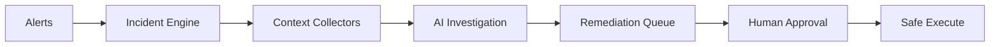

# AI-Augmented SRE Copilot

Enterprise-grade, **locally runnable** platform that investigates production incidents:
gather evidence from metrics/logs, reason with AI (**evidence-cited RCA**), and propose
remediations that **always require human approval**.

> **Status:** Phase 9 complete — full portfolio & demo pack. Phases 1–8 implemented.

Built like an internal platform engineering product — Docker Compose today,
Kubernetes-ready tomorrow. **No AWS/GCP/Azure required** for the portfolio demo.

## Why this project

| Problem | How this copilot responds |
|---------|---------------------------|
| Alert fatigue | Fingerprint dedup + incident timelines |
| AI hallucinations | RCA must cite evidence IDs; rule fallback |
| Risky automation | Propose → approve → execute (never auto) |
| “Demo only” prototypes | JWT/RBAC, OTel, Helm/GitOps packaging |

## Architecture



Detailed diagram: [docs/architecture.md](docs/architecture.md) · Sequences: [docs/sequences.md](docs/sequences.md)

## Quick start

**Prerequisites:** Docker Compose v2, ~6–8 GB RAM free.

```bash
cp .env.example .env
./scripts/up.sh
./scripts/smoke-test.sh
./scripts/demo.sh                 # guided live walkthrough
./scripts/validate-phase9.sh
```

| UI | URL | Credentials |
|----|-----|-------------|
| **Executive Dashboard** | http://localhost:8050 | `operator` / `operator123` |
| Auth API | http://localhost:8060/docs | — |
| Jaeger | http://localhost:16686 | — |
| Grafana | http://localhost:3000 | admin / admin |
| Incident API | http://localhost:8000/docs | Bearer JWT |
| Remediation API | http://localhost:8032/docs | Bearer JWT |

Full port map and OpenAPI index: [docs/API.md](docs/API.md)

### 15-minute interview demo

Follow [docs/DEMO_SCRIPT.md](docs/DEMO_SCRIPT.md). Record GIF/video: [docs/demo/RECORDING.md](docs/demo/RECORDING.md).

## Phases

| Phase | Name | Status |
|------:|------|--------|
| 1 | Observability foundation | **Done** |
| 2 | Incident engine | **Done** |
| 3 | Context collectors | **Done** |
| 4 | AI investigation (LangGraph) | **Done** |
| 4.5 | AI infrastructure (gateways) | **Done** |
| 5 | Remediation engine | **Done** |
| 6 | Executive React dashboard | **Done** |
| 7 | Production hardening | **Done** |
| 8 | Kubernetes & cloud readiness | **Done** |
| 9 | Portfolio & demo | **Done** |

## Repository layout

```
ai-sre-copilot/
├── services/          # sample-app, incident, context, knowledge, investigation,
│                      # remediation, auth, gateways, executive-dashboard
├── libs/common/       # logging, auth/RBAC, OTel, cache, resilience
├── monitoring/        # Prometheus, Grafana, Loki, OTel collector
├── infra/             # Helm, Kustomize, GitOps, Terraform Kind
├── docs/              # phases, architecture, demo, portfolio
├── scripts/           # up, demo, validate-phase*, backup
└── docker-compose.yml
```

## Portfolio pack

- [Resume bullets](docs/portfolio/RESUME_BULLETS.md)
- [LinkedIn post draft](docs/portfolio/LINKEDIN_POST.md)
- [Interview talking points](docs/portfolio/INTERVIEW_TALKING_POINTS.md)
- [Screenshot checklist](docs/SCREENSHOTS.md)

## Kubernetes (no cloud spend)

```bash
./scripts/validate-phase8.sh
helm lint infra/helm/ai-sre-copilot
# See docs/PRODUCTION_DEPLOYMENT.md
```

## Design principles

1. **Local-first** — full demo on one laptop via Compose  
2. **Evidence-backed AI** — every root cause cites evidence IDs  
3. **Human-in-the-loop** — no automatic remediation execution  
4. **Secure & observable** — JWT/RBAC, audit logs, OpenTelemetry  
5. **Kubernetes-ready** — Helm Ingress/HPA/NetworkPolicies from day one  

## Documentation

- [Architecture](docs/architecture.md) · [Sequences](docs/sequences.md) · [API](docs/API.md)
- [Phase 9](docs/PHASE9.md) · [Phase 8](docs/PHASE8.md) · [Phase 7](docs/PHASE7.md)
- [Production deployment](docs/PRODUCTION_DEPLOYMENT.md) · [DR](docs/DISASTER_RECOVERY.md) · [Security](docs/SECURITY_REVIEW.md)
- [**RCA accuracy: methodology, measured numbers, and limitations**](docs/eval.md) — how
  accurate the AI actually is, measured, not asserted; includes a 0% → 100%
  before/after from a real prompt-engineering fix
- Service READMEs under `services/*/README.md`

## License

Internal / portfolio — adjust before publishing as open source.
