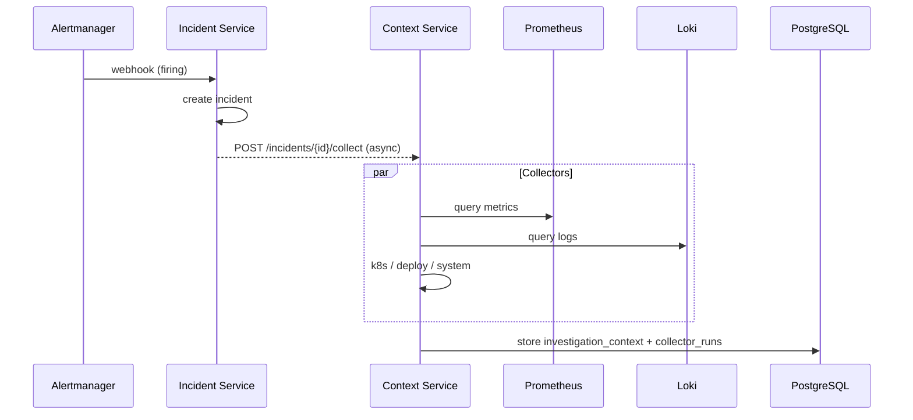

# Phase 3 — Context Collection

## Scope

Automatically gather SRE investigation evidence when an incident is created.

| Component | Role | Port |
|-----------|------|------|
| context-service | Collector orchestrator + APIs | 8020 |
| collectors | metrics, logs, k8s, deployment, system | — |

## Flow

## Validation

See [PHASE3_VALIDATION.md](./PHASE3_VALIDATION.md).

## Out of scope

LangGraph, Ollama, ChromaDB, RCA, remediation (Phase 4+).
