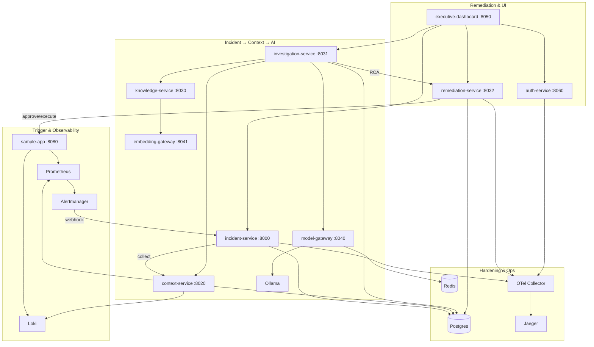

# System Architecture

End-to-end AI-Augmented SRE Copilot — local-first, Kubernetes-ready.

## Design invariants

1. **Evidence-cited RCA** — root causes reference evidence IDs; rule fallback if LLM fails.
2. **No automatic remediation** — propose → human approve → execute.
3. **Local-first** — full loop on Docker Compose; Helm/Kustomize for cluster parity.
4. **Auth on the human path** — JWT/RBAC for APIs; Alertmanager webhooks remain open.

See also: [sequences](sequences.md), [API index](API.md), [production deploy](PRODUCTION_DEPLOYMENT.md).
