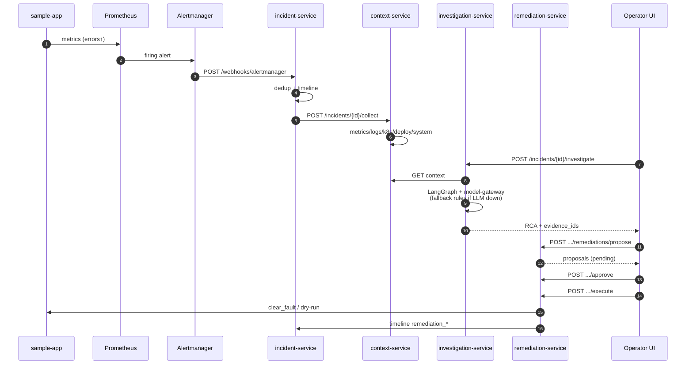
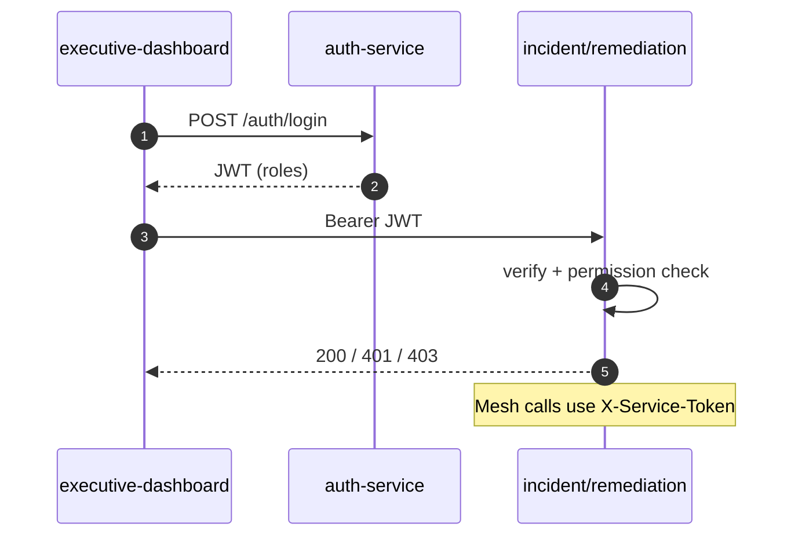
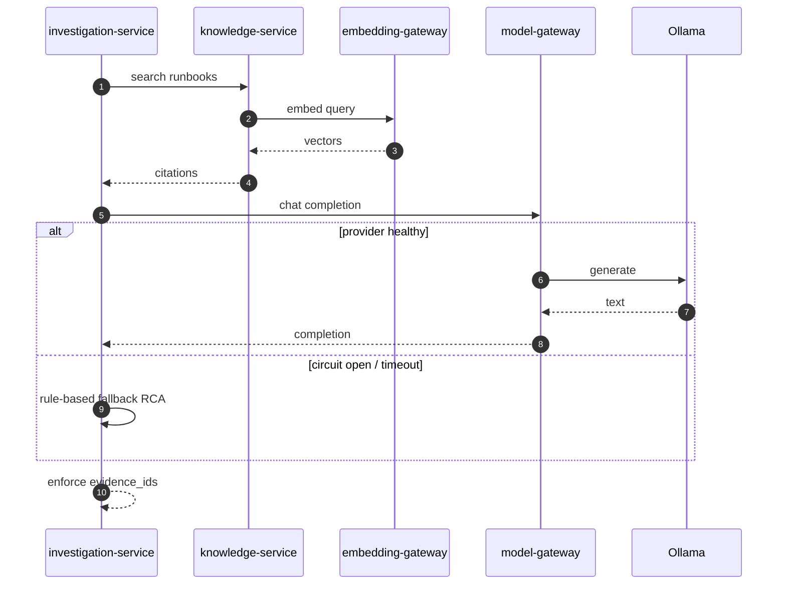

# Sequence Diagrams

## 1. Alert → Incident → Context → RCA → Remediation

```mermaid
sequenceDiagram
  autonumber
  participant App as sample-app
  participant Prom as Prometheus
  participant AM as Alertmanager
  participant Inc as incident-service
  participant Ctx as context-service
  participant Inv as investigation-service
  participant Rem as remediation-service
  participant Op as Operator UI

  App->>Prom: metrics (errors↑)
  Prom->>AM: firing alert
  AM->>Inc: POST /webhooks/alertmanager
  Inc->>Inc: dedup + timeline
  Inc->>Ctx: POST /incidents/{id}/collect
  Ctx->>Ctx: metrics/logs/k8s/deploy/system
  Op->>Inv: POST /incidents/{id}/investigate
  Inv->>Ctx: GET context
  Inv->>Inv: LangGraph + model-gateway<br/>(fallback rules if LLM down)
  Inv-->>Op: RCA + evidence_ids
  Op->>Rem: POST .../remediations/propose
  Rem-->>Op: proposals (pending)
  Op->>Rem: POST .../approve
  Op->>Rem: POST .../execute
  Rem->>App: clear_fault / dry-run
  Rem->>Inc: timeline remediation_*
```

## 2. Authentication & RBAC

```mermaid
sequenceDiagram
  autonumber
  participant UI as executive-dashboard
  participant Auth as auth-service
  participant API as incident/remediation
  UI->>Auth: POST /auth/login
  Auth-->>UI: JWT (roles)
  UI->>API: Bearer JWT
  API->>API: verify + permission check
  API-->>UI: 200 / 401 / 403
  Note over API: Mesh calls use X-Service-Token
```

## 3. Investigation with AI gateways

```mermaid
sequenceDiagram
  autonumber
  participant Inv as investigation-service
  participant Know as knowledge-service
  participant EGW as embedding-gateway
  participant MGW as model-gateway
  participant Oll as Ollama
  Inv->>Know: search runbooks
  Know->>EGW: embed query
  EGW-->>Know: vectors
  Know-->>Inv: citations
  Inv->>MGW: chat completion
  alt provider healthy
    MGW->>Oll: generate
    Oll-->>MGW: text
    MGW-->>Inv: completion
  else circuit open / timeout
    Inv->>Inv: rule-based fallback RCA
  end
  Inv-->>Inv: enforce evidence_ids
```
